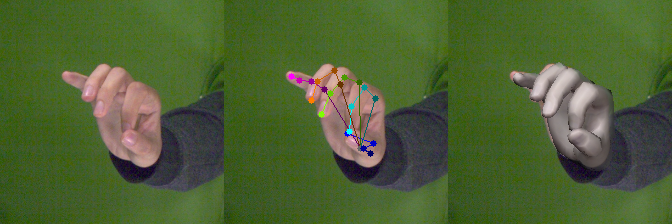
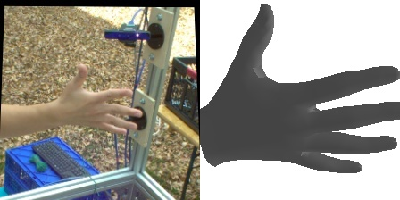
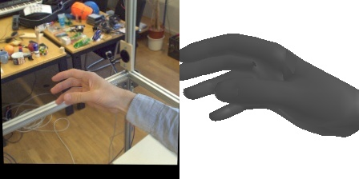
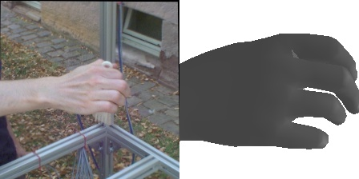
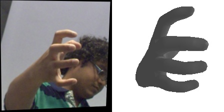

# Monocular-3d-Hand-Pose-Estimation
Implmentation of <b> Monocular 3d Hand Pose Estimation </b> using ResNet architecture. :smiley: <br>
The dataset used is FreiHAND dataset which follows the MANO format for the poses. <br>
Hence, this model can be easily integrated with SMPL-X or SMPL-H models. :wink: <br>
MANO model is used for rendering which was released by Max Plank Institute of Intelligent Systems. <br>


## Requirements
* torch >= 1.6.0
* torchvision >= 0.7.0
* trimesh >= 3.7.14
* pillow >= 7.2.0
* opencv >= 4.4.0

## Steps to Run
* Download the training and evaluation dataset from [here](https://lmb.informatik.uni-freiburg.de/data/freihand/FreiHAND_pub_v2.zip) and place it in $(ROOT). Place the testing images in the "evaluation/temp" folder. <br>
Download the checkpoint file from [here](https://drive.google.com/file/d/172Hzt_CH4dIEFFBSiyr5eFvYEBmxqvHQ/view?usp=sharing) and place it in "checkpoints" folder. (Note: The checkpoint file in the link is not fully trained. :sweat:) <br>
Final directory structure below 👇 👇
```
$(ROOT)
  |__ training
            |__rgb
                 |__ 000000.jpg
                 |__ 000001.jpg
                 |__ 000002.jpg
                        ...
   |__ evaluation
            |__rgb
                 |__ 000045.jpg
                 |__ 000046.jpg
                 |__ 000047.jpg
                        ...
            |__ temp
                 |__ 000100.jpg
                 |__ 000101.jpg 
                        ...
   |__ _checkpoints 
            |__ checkpoint_augmented_90.pth
   |__ validation.py
   |__ train.py
   ...
```
* (Optional) Change the training parameters to your needs in the train.py. :innocent: <br>
* Train the model. :sunglasses:
```
python train.py 
```
* Validate the model. :sunglasses:
```
python validation.py
```

## Results
Now for the interesting part :exclamation: :exclamation: Take a look at the results obtained. :sparkling_heart: <br>
<p align="center">
  <kbd>
  
  </kbd>
  <kbd>
   
  </kbd>
</p>

<p align="center">
  <kbd>
  
  </kbd>
  <kbd>
   
  </kbd>
</p>
</kbd>

## Final Note
The outputs are fairly accurate, but would perform even better if trained for more epochs. The checkpoint file given above is only trained for 90 epochs. :grin: <br> <br>

Go ahead..pull it, train it and have fun. :smile:

-------------------------------------
<p align="center">
:star: Happiness should be a function without any parameters :star: <br> <br>
<b>Happy Coding</b> :exclamation: :exclamation:
</p>
